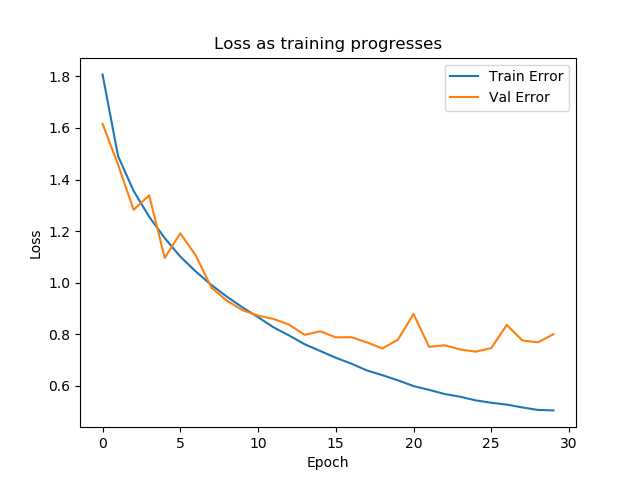

# Deep-Learning-CNN-Image-Classification

Artificial Intelligence/Deep Learning/Convolutional Neural Networks (CNN).

Deep learning is carried out using a Convolutional Neural Network (CNN) in train.py. 
50000 images are used for training and these images are labelled with one of 10 classes (0 to 9). Image class names are: airplane, automobile, bird, cat, deer, dog, frog, horse, ship, truck. There are 5000 images of each class.

Prediction of image classes (10000 images) is carried out by predict.py.

Data is sourced from Keras.datasets (cifar10). This data set is available at https://www.cs.toronto.edu/~kriz/cifar.html, which describes it in detail.

Various parameters/hyper-parameters can be easily adjusted in train.py for experimentation purposes.

